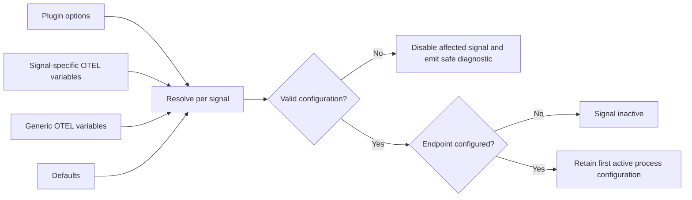

# opencode-otel

Unofficial community OpenCode plugin for privacy-conscious OpenTelemetry traces and metrics. **Work in progress:** HTTP/protobuf, HTTP/JSON, and experimental gRPC export agent-execution, tool and primary model spans and metrics. Permission and content-capture instrumentation are still being developed.

## Install from Git

In OpenCode v2, add the package to your global `~/.config/opencode/opencode.jsonc`:

```jsonc
{
  "$schema": "https://opencode.ai/config.json",
  "plugins": [
    {
      "package": "github:lexedwards/opencode-otel#main",
      "options": {
        "endpoint": "https://collector.example:4318"
      }
    }
  ]
}
```

`#main` follows development. Once a stable immutable SemVer tag exists, use e.g. `#v0.1.0` to pin it. This plugin targets OpenCode **2.0.16**, with a minimum baseline of **2.0.11**. Later v2 versions may or may not work; compatibility beyond the targeted version is best-effort.

## Configuration

Without any endpoint, the plugin prints one `[opencode-otel]` informational message and remains inactive. `endpoint` activates both signals; `traces.endpoint` or `metrics.endpoint` activates only that signal. A generic HTTP endpoint appends `/v1/traces` and `/v1/metrics`; a signal endpoint is a complete URL. gRPC endpoints identify a host and port without a path.

```jsonc
{
  "plugins": [
    {
      "package": "github:lexedwards/opencode-otel#main",
      "options": {
        "traces": {
          "endpoint": "https://collector.example:4318/v1/traces",
          "protocol": "http/protobuf"
        },
        "metrics": {
          "endpoint": "https://collector.example:4318/v1/metrics",
          "protocol": "http/protobuf"
        }
      }
    }
  ]
}
```

Fields can be set globally or per signal: `endpoint`, `protocol` (`http/protobuf`, `http/json`, or experimental `grpc`), `headers`, `timeoutMillis`, `compression` (`none` or `gzip`), `certificate`, `clientCertificate`, and `clientKey`. Standard `OTEL_EXPORTER_OTLP_*` and `OTEL_EXPORTER_OTLP_TRACES_*` / `OTEL_EXPORTER_OTLP_METRICS_*` environment settings are supported for these fields. Option values override signal-specific env values, which override generic env values, then defaults. A missing secret reference or invalid field disables the affected signal with a safe diagnostic. The plugin keeps the first process-wide configuration while instances are active; restart the OpenCode service to apply conflicting changes. Exporter initialization failures disable only the affected signal without protocol fallback.

Plugin-option header and certificate values must be `{env:NAME}` references, resolved once from the process environment. Certificate option references must resolve to PEM contents; standard `OTEL_*_CERTIFICATE`, `OTEL_*_CLIENT_CERTIFICATE`, and `OTEL_*_CLIENT_KEY` env values are certificate file paths read at setup. Secret values are held separately from printable configuration. Do not place tokens or key contents in the config file. See [HTTP OTLP collector guidance](docs/http-collector.md) and [experimental gRPC guidance](docs/grpc-collector.md).

Optional `providerNames` maps an OpenCode provider ID to a GenAI provider name (for example, `{"my-gateway": "openai"}`). Overrides apply to spans and metric dimensions and should remain low-cardinality; invalid maps are ignored with a diagnostic.



The exporter package capability matrix and Bun limitations are in [docs/otlp-compatibility.md](docs/otlp-compatibility.md). Agent telemetry observes durable execution events; tool telemetry uses before/after hooks and records `gen_ai.execute_tool.duration` and `gen_ai.invoke_agent.tool_calls`. Tool and model spans are direct children of their agent span. [Model telemetry](docs/model-telemetry.md) describes usage, latency, retry, cost, and provider mapping. It attaches no prompt, response, file path, error message, tool arguments, or tool results. Standard `OTEL_TRACES_SAMPLER` and `OTEL_TRACES_SAMPLER_ARG` settings are honored independently of metric collection. Tests run with `bun test` and `bun run typecheck`; they do not start OpenCode or a Collector.

Licensed under Apache-2.0.
