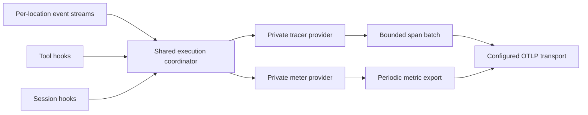
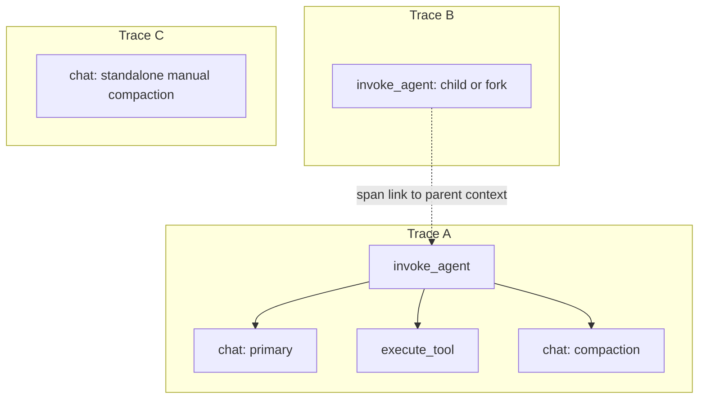

# Telemetry architecture

## Pipeline

- First plugin instance starts one process-local pipeline; the last instance shuts it down (five-second limit). No global provider is registered.
- Per-location subscriptions filter by directory. The coordinator deduplicates overlapping events and keys executions by session, tools by call ID, and models by assistant message ID.
- Content is absent by default. Explicitly enabled model, tool, and error details pass through the [privacy pipeline](content-capture.md). Permission events use bounded action/reply values.
- Opaque project and workspace IDs appear only on spans; invalid or oversized IDs become `unknown`. They are never metric dimensions.

## Trace topology

- Children and forks use separate traces linked to their parent when its context is available. Manual compaction without an active execution starts its own trace.
- Model retries enrich one logical span; terminal events end the root and measure duration even when tracing is sampled away. No ambient context is used.
- Execution, model, compaction, relation-hint, and buffered-terminal state expire after 24 hours by default (`executionExpiryMillis`). An unref'd cleanup timer runs at least once per minute; stale spans end as abandoned. The span batch is bounded.

**Verification limit:** in-memory unit tests only; no launched OpenCode or Collector interoperability test.
